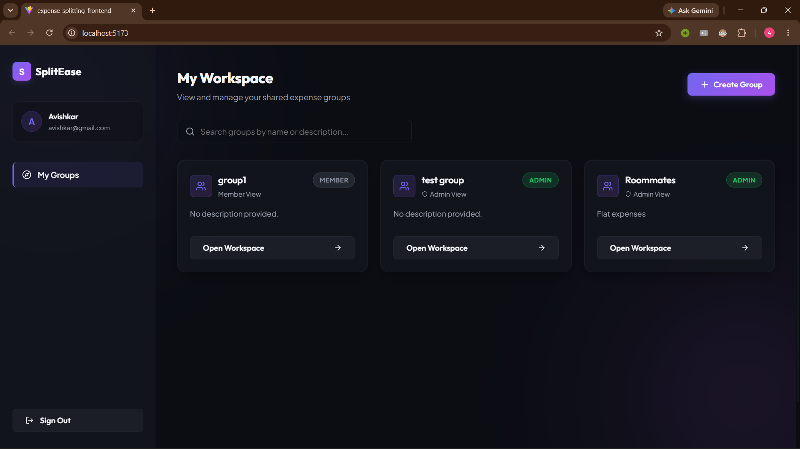
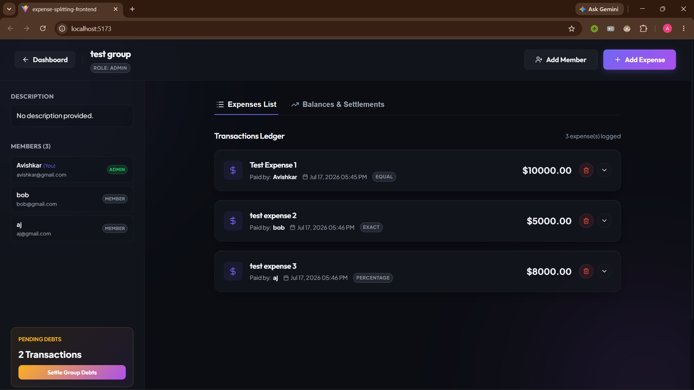
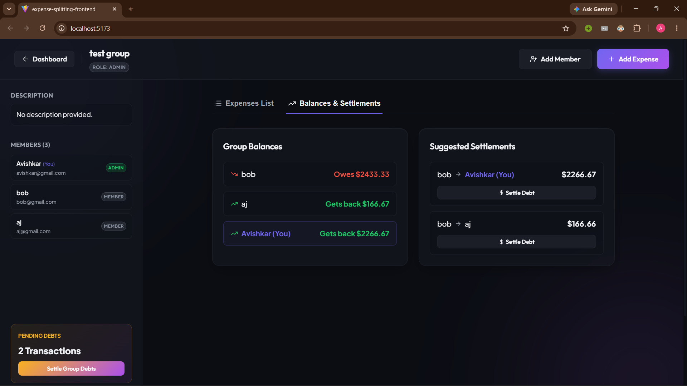
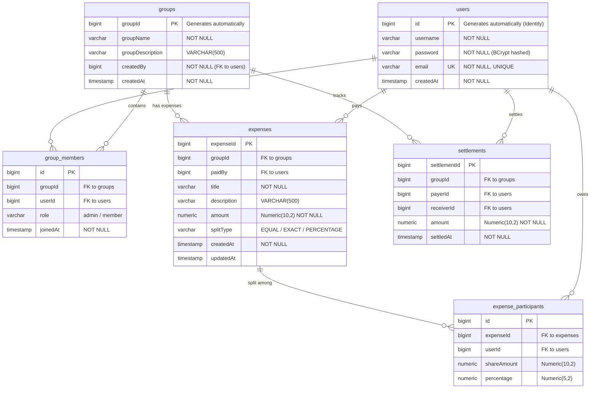

# Expense Split Platform

[](https://spring.io/projects/spring-boot)
[](https://www.oracle.com/java/)
[](https://react.dev/)
[](https://vite.dev/)
[](https://www.postgresql.org/)
[](LICENSE)

A full-stack expense sharing application inspired by Splitwise that allows users to create groups, split expenses, track balances, simplify debts, and settle payments.

---

## Project Overview

Expense Split Platform is a full-stack expense sharing application inspired by Splitwise. Users can create groups, add shared expenses, split bills using multiple strategies, track balances, simplify debts, and settle payments securely using JWT authentication.

---

## Screenshots

### Dashboard


### Group Details


### Balances & Settlements


---

## Features

- JWT Authentication
- Group creation and member management
- Equal, Exact, and Percentage expense splitting
- Expense tracking
- Dynamic balance calculation
- Greedy debt simplification
- One-click settle up
- Responsive React frontend
---

## Tech Stack

### Backend
- Java 21
- Spring Boot
- Spring Security
- JWT Authentication
- Spring Data JPA
- Hibernate
- PostgreSQL
- Maven
- Lombok

### Frontend
- React
- Vite
- CSS3
- Fetch API
- Lucide React

---

## System Architecture

```
   ┌─────────────────────────────────────────────────────────────┐
   │                       React Frontend                        │
   │      Vite Dev Server (Port 5173) | CSS Glassmorphism UI     │
   └──────────────────────────────┬──────────────────────────────┘
                                  │ HTTPS Requests + JWT (Auth Header)
                                  ▼
   ┌─────────────────────────────────────────────────────────────┐
   │                     Spring Boot Backend                     │
   │               Embedded Tomcat Server (Port 8080)             │
   │                                                             │
   │ ┌──────────────────┐  ┌──────────────────┐  ┌─────────────┐ │
   │ │  Security Filter │  │   Controllers    │  │  Services   │ │
   │ │  (JWT Auth, CORS)│  │ (REST Endpoints) │  │  (Business) │ │
   │ └─────────┬────────┘  └────────┬─────────┘  └──────┬──────┘ │
   └───────────┼────────────────────┼───────────────────┼────────┘
               ▼                    ▼                   ▼
   ┌─────────────────────────────────────────────────────────────┐
   │                      Spring Data JPA                        │
   │                     PostgreSQL Database                     │
   │              (Dynamic DDL & Connection Pooling)             │
   └─────────────────────────────────────────────────────────────┘
```

---

## Database Schema (ER Diagram)



---

## API Endpoints

All backend endpoints are prefixed with `/api`. Security rules mandate that all requests (except register and login) carry a valid JWT token.

### Authentication & Users
| Endpoint | Method | Authentication | Description |
| :--- | :--- | :--- | :--- |
| `/api/auth/register` | `POST` | Public | Registers a new user. |
| `/api/auth/login` | `POST` | Public | Authenticates credentials and returns a JWT token. |
| `/api/users/me` | `GET` | User JWT | Retrieves profile data of the logged-in user. |
| `/api/search` | `GET` | User JWT | Dynamic member lookup by query string (`?query=...`). |

### Groups
| Endpoint | Method | Authentication | Description |
| :--- | :--- | :--- | :--- |
| `/api/groups` | `GET` | User JWT | Lists all groups the current user belongs to. |
| `/api/groups/create` | `POST` | User JWT | Creates a new expense group. |
| `/api/groups/{groupId}` | `GET` | User JWT | Gets detail configuration, members, expenses, and settlements. |
| `/api/groups/{groupId}/add-member` | `POST` | User JWT | Invites users to join the group. |

### Expenses
| Endpoint | Method | Authentication | Description |
| :--- | :--- | :--- | :--- |
| `/api/groups/{groupId}/expenses` | `POST` | User JWT | Submits a new expense with chosen splitting parameters. |
| `/api/groups/{groupId}/expenses` | `GET` | User JWT | Fetches brief summary of all expenses in a group. |
| `/api/expenses/{expenseId}` | `GET` | User JWT | Gets detailed participant share breakdown of a single expense. |
| `/api/expenses/{expenseId}` | `DELETE` | User JWT | Deletes an expense and dynamically adjusts outstanding balances. |

### Settlement & Balance Calculation
| Endpoint | Method | Authentication | Description |
| :--- | :--- | :--- | :--- |
| `/api/groups/{groupId}/balances` | `GET` | User JWT | Computes net balances (positive for creditors, negative for debtors). |
| `/api/groups/{groupId}/simplified-debts` | `GET` | User JWT | Computes optimized debt settlement plan (Greedy algorithm). |
| `/api/groups/{groupId}/settle-up` | `POST` | User JWT | Triggers full group settle-up, setting everyone's balance to zero. |

---

## Project Folder Structure

```
Expense-Split-Platform/

backend/
    controller/
    service/
    repository/
    strategy/
    model/
    dto/

frontend/
    components/
    context/
    services/
    views/
```
---
## Project Highlights

- Strategy Pattern for expense splitting
- Greedy algorithm for debt simplification
- JWT-based authentication
- Dynamic balance calculation

---

## Design Decisions & Architecture

### 1. Strategy Pattern for Expense Splitting

The application uses the **Strategy Design Pattern** to support multiple expense splitting methods while keeping the code extensible.

- `EqualSplitStrategy` – Splits the amount equally among participants.
- `ExactSplitStrategy` – Uses user-provided amounts and validates that the total equals the expense amount.
- `PercentageSplitStrategy` – Calculates shares based on percentages and validates that they total 100%.

`SplitStrategyFactory` selects the appropriate strategy at runtime based on the selected `SplitType`.

### 2. Greedy Debt Simplification

To minimize the number of transactions required to settle balances, the application uses a greedy algorithm.

The algorithm:

1. Calculates each member's net balance.
2. Separates members into creditors and debtors using priority queues.
3. Matches the highest creditor with the highest debtor until all balances are settled.

Time Complexity: **O(N log N)**.

### 3. Dynamic Balance Calculation

Balances are calculated dynamically from expenses and settlements instead of being stored in the database.

Net Balance = Total Paid − Total Owed + Settlements Received − Settlements Paid

This ensures balances always remain consistent, even if expenses or settlements change.

---

### 4. JWT Authentication

The application uses **JWT-based stateless authentication**.

- Users receive a JWT after successful login.
- Protected endpoints require a valid JWT.
- Spring Security validates every request using a custom JWT filter.
- No server-side session is maintained.

---

## Installation and Setup

### Prerequisites
- **Java Platform**: SDK / JDK 21
- **Node.js**: Version 18 or above (comes with npm)
- **Database**: PostgreSQL Instance (Local or cloud-hosted)
- **Build Tool**: Apache Maven (v3.x)

---

### Backend Setup

1. **Database Setup**:
   Create a PostgreSQL database named `expenseMgmt`:
   ```sql
   CREATE DATABASE "expenseMgmt";
   ```

2. **Configure Database Settings**:
   Navigate to `application.properties` and update the database url, username, and password credentials:
   ```properties
   spring.datasource.url=jdbc:postgresql://localhost:5432/expenseMgmt
spring.datasource.username=YOUR_USERNAME
spring.datasource.password=YOUR_PASSWORD
jwt.secret=YOUR_SECRET

   ```

3. **Build the Application**:
   Navigate to the backend directory and run:
   ```bash
   cd expense-splitting-backend
   mvn clean install
   ```

4. **Launch Backend Server**:
   Start the application using Maven:
   ```bash
   mvn spring-boot:run
   ```
   *The REST API server will launch and listen on `http://localhost:8080`.*

---

### Frontend Setup

1. **Navigate to the Frontend Directory**:
   ```bash
   cd expense-splitting-frontend
   ```

2. **Install Node Packages**:
   Install all dependencies declared in package.json:
   ```bash
   npm install
   ```

3. **Start the Development Server**:
   Launch the Vite server:
   ```bash
   npm run dev
   ```
   *The frontend dashboard will load at `http://localhost:5173`.*

---

## Future Enhancements

- Edit and delete expenses with automatic balance recalculation.
- User profile management.
- Expense categories and filters.
- Email notifications for settlements and group invitations.
- Multi-currency support.
- Improved analytics and expense summaries.
